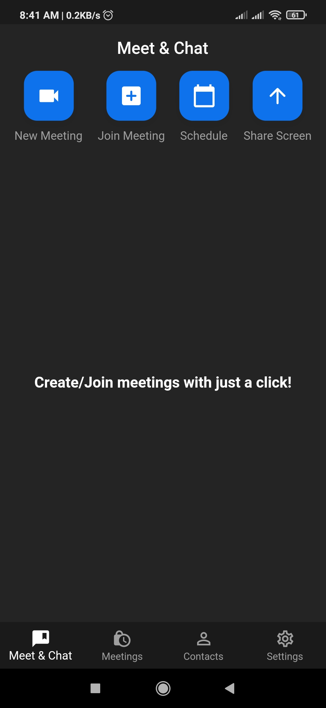
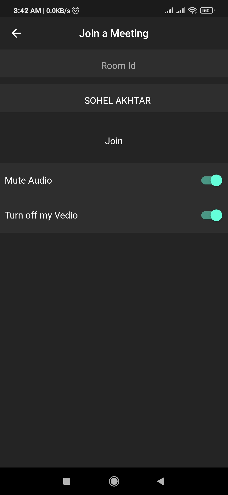
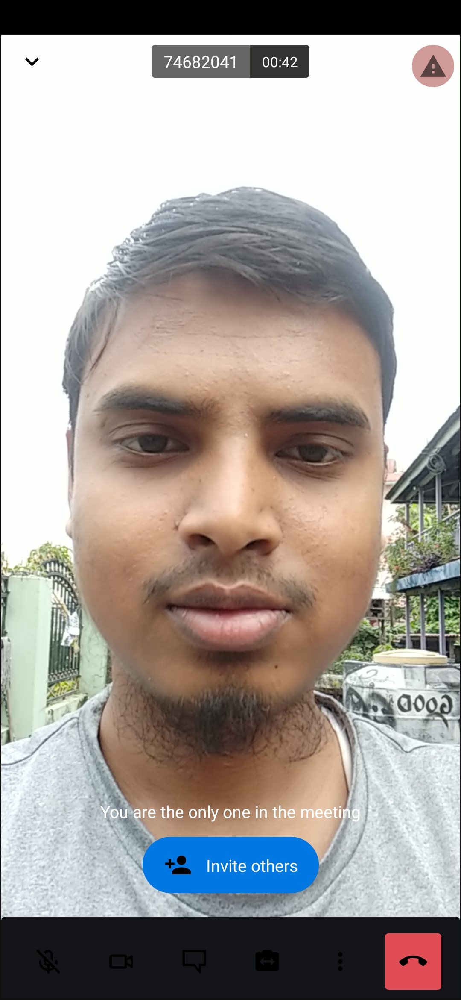
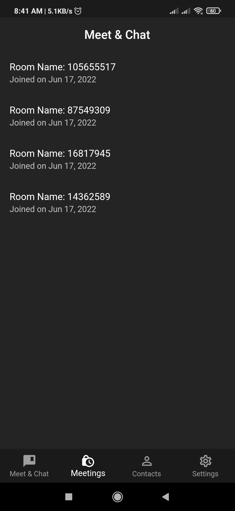

# Zoom Clone

Zoom Clone that works on Android & iOS!
 Get the app from link below 
https://drive.google.com/file/d/1DdkBHnvefJAc0MSBQr9UkZaQI0wU417I/view?usp=sharing

## Tech Used

<b>Flutter</b>, Firebase Auth, Firestore, Google Sign In, <b>Jitsi Meet</b> 

## Screenshots 

  
  
  
  

## Features
1. Google Sign In
2. Create New Meeting
3. Join Meeting
4. Mute/Unmute Audio
5. Mute/Unmute Video
6. Change Display Name while Joining
7. Raise Hand
8. Start Screen Sharing
9. Mute Everyone
10. Start Live Stream
11. Screen Share
12. Chat
13. Switch Front/Rear Camera
14. Picture in Picture
15. End Call
16. See Your Meeting History
17. Log out

#### Special Thanks => Rivaan

<!--  -->

